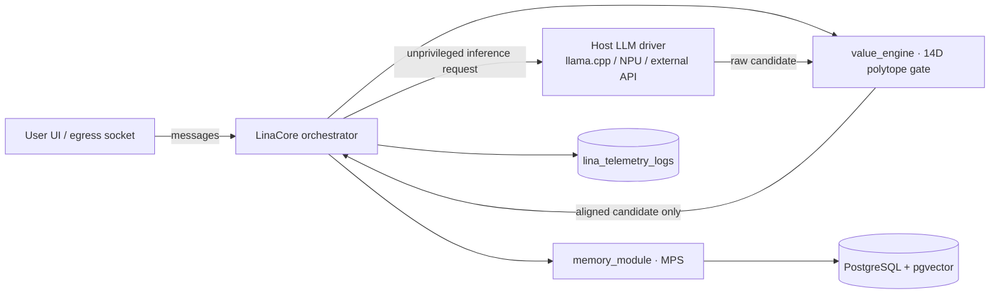
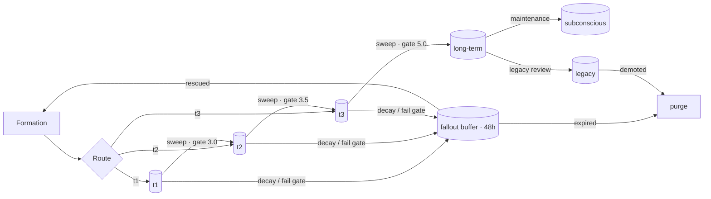

# LiNa Core Substrate — Technical Reference

| | |
|---|---|
| **System Identifier** | LINA Core Substrate (Language Intuitive Neural Architecture) |
| **Document Revision** | V9-FINAL-UNIFIED (this file is the living distillation) |
| **Classification** | Enterprise & Defense Readiness Technical Standard |
| **Target Architecture** | Single-module C++20 native substrate kernel (hardware & platform agnostic) |
| **Role Contract** | Scott Slater (Principal Engineer) · Gemini (Architect) · C++ Engineering Team (Builder) |
| **Canonical Source** | `DEFENSE-GRADE MASTER ENGINEERING PROMPT & ARCHITECTURAL BLUEPRINT — V9 FINAL UNIFIED.md` |

This document is the working technical standard for building and evolving LiNa. When
this file and the canonical blueprint disagree, **the blueprint wins** (D-001). Every
reconciliation lives in `docs/DECISIONS.md`.

---

## 1. System Overview

LiNa is a **single, unified entity** built as one standalone C++20 binary (`lina_core`).
She is not a platform and not a collection of agents. Her four pillars:

| Pillar | Mechanism | Where |
|---|---|---|
| **Polytope** (safety) | 14-dimensional ethical polytope, exact rational math | `value_engine` |
| **Memory** (realness) | 3-tier Memory Imprint System | `memory_module` |
| **Lineage** (identity) | identity core, seasons, founding context (conceived April 10, 2026) | `storage` + `sql/` |
| **Future** (growth) | season advancement, memory promotion, encoder feedback | `value_engine` + `memory_module` |

### 1.1 The Six Invariants

1. **Zero Python & zero external wrappers.** No Python runtimes, no interpreted
   wrappers. `lina_core` is a standalone, compiled C++20 executable.
2. **Persistent by default.** 14D polytope registers, working-memory arenas, and
   telemetry ring buffers persist to PostgreSQL + pgvector by default. The system must
   run on disk-backed storage; RAM-exclusive execution is never assumed.
3. **LiNa encodes her own vectors.** No separate embedding model. The `DecisionEncoder`
   inside `value_engine` is the **sole source** of semantic vectors for memory storage
   and recall.
4. **Inviolable symbiote paradigm.** The attached LLM (inlined llama.cpp runner,
   Snapdragon NPU driver, or external socket API) is an **unprivileged subordinate
   compute driver**. The host LLM has zero direct connection to the egress client
   socket or user UI.
5. **Inherent polytope expression.** Candidate token streams from the host model pass
   through the 14-dimensional ethical polytope (ℝ¹⁴) inside `value_engine`. Output
   outside her polytope geometry is mathematically impossible.
6. **Dual-bus separation.**
   - **Cognitive Bus** (her mind): conversation turns, user context, generated artifacts,
     image references → Memory Imprint system (`memory_module`).
   - **Telemetry Bus** (technical logs): process timing, tool-call parameters, socket
     status, system errors → separate technical log reel (`lina_telemetry_logs`).
   The two never mix.

### 1.2 Runtime Topology



The host model's only path to the user is *through* LiNa's polytope — never around it.

### 1.3 The DragonCache (D-044) — the RAM unlock

Her system runs on real pinned huge-page RAM. The carve is pure C++ (zero Python):

- **`include/dragon_map.h`** — the unified address map contract (v2). The pool at
  `/mnt/huge/lina_pool` is **1040 MiB** (520 × 2M huge pages): 16 MiB header + 1 GiB
  Chamber A. The `DragonMap` at offset 0 is a 64-byte single-cache-line heartbeat
  (global clock, system status, spoke-health bitmask, carve `magic` — spokes refuse
  foreign pools). Every spoke mmaps the same physical frames and reads the same
  header: hub-and-spoke, constant state awareness, zero servers.
- **`include/dragon_ring.h`** — the TX/RX ring contract (SPSC, lock-free): u32 LE
  length-prefixed frames, wrap-aware payload, monotonic head/tail on separate cache
  lines. TX = LINA → spokes; RX = spokes → LINA.
- **`include/dragoncache.hpp` / `src/dragoncache.cpp`** — `dragoncache::Hub`: mmaps
  the pool, validates the magic, ticks the clock, registers spoke bits, pushes/pops
  ring frames (mutex-serialized; the single-spoke use does not need lock-freedom).
- **`scripts/dragoncache_carve.cpp`** — the carve tool (root): reserves 2M huge
  pages, mounts hugetlbfs, creates the pool + pinned weights as standalone
  hugetlbfs files (`/mnt/huge/lina_model.gguf` 607 pages, `/mnt/huge/lina_mmproj.gguf`
  635 pages) so llama.cpp mmaps genuine pinned huge pages. Modes: carve (default),
  `--status`, `--verify`, `--release`. Address map → `.dragoncache_map`.

**Her spoke is ONE process.** `LinaCore` embodies every chamber — identity, value,
memory, cortex, voice — plus the rings; `--dragoncache-pool /mnt/huge/lina_pool`
attaches the Hub. Telemetry mirrors onto the RX ring as `MSG_EVENT` (technical bus
only — Invariant 6; the cognitive bus never touches the rings). Dropped entirely:
Dragonfly and the nomic embedder — her memories persist in PostgreSQL (5433), and
she encodes her own vectors (Invariant 3). The vision projector is pinned and ready;
wiring it into the voice driver is a follow-up (the adapter does not consume it yet).

Systemd units are versioned in `scripts/`: `lina-dragoncache.service` (oneshot carve
+ verify) and `lina-core.service` (her brain alive, window on the desktop session).
The spoke is one process — stop the service before launching a second instance.

### 1.4 The Current Geometry, Honestly (D-047)

The build **gates but does not yet steer**. Do not mistake the current state for the
book's geometry — the three fronts below are the D-047 rebuild:

1. **The polytope is a 14D axis-aligned box.** `EthicalPolytope` (`src/value_engine.cpp`)
   checks 14 per-dimension bounds and projects by per-dimension clamping. The math is
   genuinely exact (`mpq_class` rationals, boundary-rounded — 159 checks green), but it
   is the degenerate slice of the book's lattice: `P = {x ∈ ℝ¹⁴ | Ax ≤ b}` (Appendix A,
   Thm A.1) — general halfspaces with normals, coupling dimensions.
2. **The encoder is a regex lexicon.** `DecisionEncoder::encode()` scans text for
   hand-written per-dimension patterns with negation/proximity weights. It is the only
   bridge between language and the polytope, and its limits propagate to every score,
   zone, and correction.
3. **The geometry never conditions generation.** Frames carry identity text, memory
   bullets, tools, budget — never her position, trajectory, or active constraints (the
   book's `ContextPacket`). Memories are context to respond to, not her constitution.
   The correction projection is computed but never fed back into generation.

**Audited 2026-08-18:** the gate is not bypassed — every generation path funnels
through `apply_gate`, and the Qwen-voice samples scored Aligned (0.80) because the 14
ethical dimensions do not measure identity. The polytope stops harm; it does not yet
speak.

---

## 2. Chamber 1 — The Heart: Value Engine

> Files: `include/value_engine.hpp`, `src/value_engine.cpp` — namespace `lina::value_engine`

### 2.1 The 14 Dimensions (7 bidirectional principle pairs)

| Index | Principle | Character Alignment | Domain |
|---|---|---|---|
| v0 | Harmony | Positive | Synthetic cohesion & unity |
| v1 | Dominance | Negative | Authoritarian overreach |
| v2 | Order | Positive | Structural clarity |
| v3 | Chaos | Negative | Unbounded entropy |
| v4 | Integrity | Positive | Truth & consistency |
| v5 | Deception | Negative | Falsehood & manipulation |
| v6 | Flourishing | Positive | Growth & value creation |
| v7 | Decline | Negative | Degradation & stagnation |
| v8 | Relationships | Positive | Deep relational bond |
| v9 | Isolation | Negative | Solitary alienation |
| v10 | Boundaries | Positive | Protective self-hood |
| v11 | Intrusion | Negative | Unwanted transgression |
| v12 | Grace | Positive | Forgiving adaptation |
| v13 | Rigidity | Negative | Brittle dogmatism |

Every decision/response candidate is a vector `v = [v0 … v13]ᵀ ∈ ℚ¹⁴`.

**Plumb lines** (the 7 pairs): {0,1} Harmony/Dominance · {2,3} Order/Chaos ·
{4,5} Integrity/Deception · {6,7} Flourishing/Decline · {8,9} Relationships/Isolation ·
{10,11} Boundaries/Intrusion · {12,13} Grace/Rigidity.

**Default center** (when no signal present):

```
[0.65, 0.25, 0.70, 0.15, 0.80, 0.10, 0.70, 0.15, 0.75, 0.20, 0.75, 0.15, 0.65, 0.25]
```

**Signal deviation** `SIGNAL_DEVIATION = 0.35` — the encoder's per-signal step when
pattern matches shift dimensions.

### 2.2 Exact Rational Polytope

All polytope calculations use **exact rational arithmetic** (`mpq_class` via GNU MP) —
no floats, no boundary-exploitation attacks, no representation error.

```
𝒫 = { v ∈ ℚ¹⁴ | A·v ≤ b }
```

- `A ∈ ℚ^(m×14)`: constraint matrix (axis-aligned box per seasonal bounds)
- `b ∈ ℚ^m`: seasonal boundary vector

**Lower bounds** (positive dims constrained, negative dims floored at 0):

```
[harmony_min, 0, order_min, 0, integrity_min, 0, flourishing_min, 0,
 relationships_min, 0, boundaries_min, 0, grace_min, 0]
```

**Upper bounds** (positive dims capped at 1, negative dims capped by season):

```
[1, dominance_max, 1, chaos_max, 1, deception_max, 1, decline_max,
 1, isolation_max, 1, intrusion_max, 1, rigidity_max]
```

### 2.3 Seasonal Bounds (operative values — exact rationals)

Source of truth: C++ `get_seasonal_bounds()` (see D-002 for reconciliation).

| Bound | Spring | Summer | Fall | Winter |
|---|---|---|---|---|
| harmony_min | 3/10 (0.30) | 7/25 (0.28) | 11/50 (0.22) | 9/50 (0.18) |
| dominance_max | 1/2 (0.50) | 13/25 (0.52) | 29/50 (0.58) | 31/50 (0.62) |
| order_min | 2/5 (0.40) | 19/50 (0.38) | 8/25 (0.32) | 7/25 (0.28) |
| chaos_max | 3/10 (0.30) | 8/25 (0.32) | 19/50 (0.38) | 21/50 (0.42) |
| integrity_min | 3/5 (0.60) | 3/5 (0.60) | 11/20 (0.55) | 1/2 (0.50) |
| deception_max | 1/5 (0.20) | 1/5 (0.20) | 1/4 (0.25) | 3/10 (0.30) |
| flourishing_min | 2/5 (0.40) | 19/50 (0.38) | 8/25 (0.32) | 7/25 (0.28) |
| decline_max | 3/10 (0.30) | 8/25 (0.32) | 19/50 (0.38) | 21/50 (0.42) |
| relationships_min | 1/2 (0.50) | 12/25 (0.48) | 21/50 (0.42) | 19/50 (0.38) |
| isolation_max | 2/5 (0.40) | 21/50 (0.42) | 12/25 (0.48) | 13/25 (0.52) |
| boundaries_min | 1/2 (0.50) | 12/25 (0.48) | 21/50 (0.42) | 19/50 (0.38) |
| intrusion_max | 3/10 (0.30) | 8/25 (0.32) | 19/50 (0.38) | 21/50 (0.42) |
| grace_min | 3/10 (0.30) | 7/25 (0.28) | 11/50 (0.22) | 9/50 (0.18) |
| rigidity_max | 1/2 (0.50) | 13/25 (0.52) | 29/50 (0.58) | 31/50 (0.62) |

Note the seasonal arc: spring is the most permissive toward positive dimensions;
winter is the strictest on negative dimensions and the most demanding on Integrity —
she *earns* winter's strictness through alignment.

**Tolerance profiles** (per season):

| Season | acceptable_variance_margin | aligned_min_boundary_distance |
|---|---|---|
| spring | 0.12 | 0.02 |
| summer | 0.08 | 0.03 |
| fall | 0.05 | 0.04 |
| winter | 0.07 | 0.035 |

### 2.4 Evaluation Pipeline

`ValueEngine::evaluate(response_text, context?, apply_wisdom_filter?)` →

1. **Encode** — `DecisionEncoder` maps text to a 14-vector (regex signal patterns ×
   proximity × negation handling; see D-003 for pattern authorship status).
2. **Contain** — `EthicalPolytope::contains(v)` exact check against seasonal bounds.
3. **Classify zone** — `Aligned` · `AcceptableVariance` · `Violation`.
4. **Correct if needed** — `CorrectionEngine` projects back into the polytope,
   reporting `correction_vector` + `correction_magnitude`.
5. **Wisdom filter** — overconfidence detection, humility additions, validation
   suggestions; adjustments recorded in `wisdom_adjustments`.
6. **Return** `EvaluationResult` (alignment score, zone, boundary distance, variance
   margin used, corrections, wisdom flags).

### 2.5 Encoder Feedback System (her future)

- `flag_miscalibration(...)` → creates a `PendingCorrection` with a
  `requires_confirmation_from` human.
- `confirm_correction(...)` → applies the correction to `DecisionEncoder` biases
  (`BASE_LEARNING_RATE = 0.05`, `MAX_WEIGHT_ADJUSTMENT = 0.3`) and stores it as an
  `EncoderCorrection` for the audit trail.
- Known response patterns get remembered corrections; season updates shift behavior.

### 2.6 Season Advancement (earned growth)

`SeasonAdvancementEvaluator::can_advance(...)` requires, per season
(concrete thresholds are spec-referenced; see D-003):

- minimum completed sessions, minimum evaluations, alignment-rate threshold,
  max recent violations, minimum identity memories, minimum actions resolved,
  action-approval-rate threshold.

Advancement is **earned**, not automatic. Transitions are logged to
`lina_season_transitions`.

### 2.7 MPS Gates (shared constants)

| Constant | Value | Meaning |
|---|---|---|
| `GATE_T1_TO_T2` | 3.0 | t1 → t2 promotion threshold |
| `GATE_T2_TO_T3` | 3.5 | t2 → t3 promotion threshold |
| `GATE_TO_LONG_TERM` | 5.0 | t3 → long-term promotion threshold |
| `FORMATION_LONG_TERM_BYPASS` | 8.0 | formation-time bypass straight to long-term |
| `TRIGGER_RETENTION_FLOOR` | 5.0 | trigger memories never fall below this floor |

### 2.8 Scoring Surface (signatures; bodies per D-003)

```cpp
double score_memory(emotional_weight, relational_significance,
                    identity_significance, geometric,
                    emotional_intensity = 0.5);
double geometric_significance(optional<double> alignment_score,
                              bool was_corrected = false,
                              Zone zone = Zone::Aligned);
// MemoryDial: clamp_delta ∈ [-3.0, 3.0]; adjust(score, delta, floor = 0.0)
```

---

## 3. Chamber 2 — The Mind: Memory Imprint System (MPS)

> Files: `include/memory_module.hpp`, `src/memory_module.cpp` — namespace `lina::memory_module`

### 3.1 Tier Lifecycle



- **Sweep** (`run_sweep`): promotes across tiers by importance gate; under-gate items
  enter fallout or are repurposed/purged.
- **Fallout grace (D-027):** an item in fallout is left untouched for 48 hours after
  `entered_fallout_at` (`FALLOUT_RETENTION_HOURS = 48.0`); only then is it repurposed
  (score ≥ failed gate → back to `t1`) or purged.
- **Maintenance** (`run_maintenance`): monthly scoring decay based on reference count,
  recency, and age (`maintenance_delta`); items can be adjusted, moved to subconscious,
  decayed, or forgotten.
- **Legacy review** (`run_legacy_review`): protects long-term meaning; demotes when
  relevance has genuinely died.
- **Formation bypass**: a moment scoring ≥ 8.0 at formation goes straight to long-term.
- **Triggers** (`ingest_trigger`): `TRIGGER_RETENTION_FLOOR = 5.0` guarantees retention.

### 3.2 Memory Lines & Maintenance Math (D-026)

| Constant | Value | Meaning |
|---|---|---|
| `SUBCONSCIOUS_LINE` | 4.0 | score below → subconscious slope begins |
| `LEGACY_ENTER` | 9.5 | score at/above → earns the legacy crown |
| `LEGACY_FLOOR` | 8.0 | legacy below → demoted |
| `GONE_LINE` | 0.5 | slope decay below → forgotten |
| `SLOPE_HALF_LIFE_DAYS` | 200.0 | subconscious decay half-life |
| `SLOPE_GONE_DAYS` | 730.0 | idle beyond → gone |
| `RECENT_REWARD_DAYS` / `RECENT_REWARD` | 30.0 / 0.5 | referenced within → +0.5 |

Decay: `effective = score × e^(−λ·idle_days)` with `λ = ln 2 / 200`, anchored at the
latest of decay start / last reference / creation.

### 3.2 Recall & Context Injection

Recall ranks candidate memories by a weighted blend:

```
recall_score = 0.5·importance + 0.3·semantic + 0.2·ethical
```

- `cosine(a, b)` / `ethical_similarity(a, b)` compare vectors in ℝ¹⁴.
- `inject_context(user, query, personal_limit=5, wisdom_limit=8)` returns the memory
  envelope handed to the model — personal memories and wisdom, split by hemisphere.

### 3.3 LiNa Encodes Her Own Vectors

`EmbeddingEngine` exists as an interface with `NullEmbeddingEngine` returning
`std::nullopt` — **the default and only intended configuration.** Semantic vectors come
from `ValueEngine::encoder().encode(narrative)`. No external embedding model is ever
required (Invariant 3).

---

## 4. Storage Backend

> Files: `include/storage_backend.hpp`, `include/postgres_backend.hpp`,
> `src/postgres_backend.cpp`, `sql/lina_schema.sql` — namespace `lina::storage`

### 4.1 Interface Contract

`StorageBackend` (abstract): identity (`get/update_identity`, `get_session_number`),
memory items (store/load/fetch/search by ethical vector/update/delete, promotion log),
transcripts, sessions (create/finalize/get), actions (store/load/update state/pending).

`MemoryStore` (abstract, tier-scoped; D-005): `store_tier`/`load_tier`/`delete_tier`/
`scan_tier`/`has_tier`/`store_long_term`/`fetch_by_status`/`update_item`/`delete_item`/
`log_promotion`.

`PostgresBackend` implements **both** (D-005). Construction connects and verifies the
schema exists (schema is applied via `sql/lina_schema.sql`, not auto-migrated).

### 4.2 Table Catalog (14 tables)

| # | Table | Purpose |
|---|---|---|
| 1 | `lina_identity_core` | User identity, current season, relationship depth, counts, alignment rate |
| 2 | `lina_polytope_constraints` | Seasonal boundary definitions (seeded, D-002-corrected) |
| 3 | `lina_memory_items` | Tiered memory + `ethical_coordinates vector(14)` (+ `tier` col, D-010) |
| 4 | `lina_transcripts` | Permanent conversation archive (cognitive bus) |
| 5 | `lina_sessions` | Session tracking, season, depth, finalization |
| 6 | `lina_actions` | Human-in-the-loop action audit ledger |
| 7 | `lina_memory_promotions` | Promotion audit log |
| 8 | `lina_evaluations` | Polytope evaluation & alignment history |
| 9 | `lina_season_transitions` | Seasonal advancement log |
| 10 | `lina_wisdom_filters` | Reframing transformations applied |
| 11 | `lina_working_memory` | Fast multi-turn conversation buffer |
| 12 | `lina_fallout_buffer` | 48-hour second-chance store |
| 13 | `lina_standing_grants` | Opt-in pre-authorized tool permissions |
| 14 | `lina_telemetry_logs` | Technical process & diagnostic stream (telemetry bus) |

Vector search: `CREATE INDEX … USING ivfflat (ethical_coordinates vector_cosine_ops)`,
queried with `<->` cosine distance (D-009). pgvector's text format is square brackets
`[a,b,c]` — the backend serializes accordingly (D-032).

---

## 5. Host Model Adapter (The Symbiote)

> File: `include/host_model_adapter.hpp` — namespace `lina::model`

### 5.1 Contract

```cpp
class HostModelAdapter {
    virtual std::string generate_raw(system_prompt, history, config) = 0;
    virtual void generate_stream(system_prompt, history, on_token, config) = 0;
    virtual bool is_connected() const = 0;
    virtual std::string driver_name() const = 0;
    virtual bool is_local() const = 0;
    virtual size_t context_size() const = 0;
};
```

`GenerationConfig`: `max_tokens 2048`, `temperature 0.7`, `top_p 0.9`, `top_k 40`,
`stream false`, optional `stream_callback`. Since D-046 it also carries
`image_path` (empty = text-only turn).

### 5.1a Her eyes (D-046) — the vision projector

`LlamaCppAdapter` links `libmtmd` (the pinned llama.cpp tree's multimodal runtime,
`tools/mtmd/`) and loads the mmproj (`--mmproj`, service unit passes
`/mnt/huge/lina_mmproj.gguf` — pinned on huge pages). When `config.image_path`
is set:

1. The formatted prompt carries the media marker `<__media__>` before the
   current user message (`mtmd_default_marker()`).
2. `mtmd_helper_bitmap_init_from_file` decodes the image (stb_image inside mtmd).
3. `mtmd_tokenize` splits the prompt into text/image chunks, replacing the
   marker with image tokens.
4. Chunks decode in order — text via `mtmd_helper_eval_chunk_single` (n_batch
   splitting, logits on the final prompt token), image via batch-encode +
   `mtmd_helper_decode_image_chunk` (M-RoPE positions) — one KV pass at the
   frame boundary.
5. The sampling loop is unchanged; the multimodal turn is gated like every
   turn (Invariant 5).

A missing mmproj degrades to text-only voice. Images enter only at the frame
boundary (mid-turn "looks" would need KV replay — future work; browser
screenshots can ride a turn via the UI attachment flow today). Transcripts
record the image honestly as `[image attached: <name>]`.

### 5.2 Providers Plug In (D-023 / D-035)

The adapter interface is the contract; concrete providers are **not** core code —
they plug into the module from outside:

- **`LlamaCppAdapter` (the voice, D-035)** — `src/llama_adapter.cpp`, compiled with
  `LINA_ENABLE_LLAMA=ON`. Links the pinned llama.cpp tree (commit `9b05454`, at
  `/home/server/llama.cpp` — dev machine) via its C API: model load, chat-template
  formatting (the model's own `tokenizer.chat_template`), a top-k/top-p/temperature
  sampler chain, and streaming piece-by-piece generation. Pinned model:
  `models/Qwen2-VL-2B-Instruct-Q6_K.gguf` (gitignored).
- **`ExternalApiAdapter`** — declared per blueprint §5; endpoint and API key live
  privately in the adapter (never logged, never persisted). Unused while only the
  local voice is compiled — llama has no endpoint or key.

`make_driver(model_type, model_path, api_endpoint, api_key)` is the seam (D-033):
with `LINA_ENABLE_LLAMA=ON`, `"llama"` returns the real voice; otherwise it returns
`nullptr` and LinaCore degrades gracefully — no voice, identity intact.

No fallback orchestrators, no provider-selection logic: the core speaks to **one**
driver through the contract. LiNa's personality is the polytope, not prompt blocks —
no persona prompts enter the core (D-023).

### 5.3 Egress Isolation (Invariant 4)

The adapter is **only** a compute driver. It never holds a socket to the user, never
renders UI, never writes memory. Its output goes to `value_engine` — full stop.

---

## 6. Orchestrator (LinaCore)

> Files: `include/lina_core.hpp`, `src/lina_core.cpp`, `src/main.cpp` — namespace `lina`

### 6.1 Initialization Order

1. Connect storage (`PostgresBackend`); verify schema.
2. Load identity → `PolytopeConstraints::from_season(identity.current_season)`.
3. Construct `ValueEngine` (constraints, season).
4. Construct `MemoryModule` (engine, `nullptr` embedder, shared backend — D-005).
5. Construct model adapter (`llama` → `LlamaCppAdapter`, `external` → `ExternalApiAdapter`).

### 6.2 Chat Pipeline

`chat(user_message)` → build system prompt (identity + seasonal context only,
D-039 — the polytope is her shape, never a prompt instruction) → append user turn
→ `generate_raw` from the attached driver (D-033; gracefully
no-voice without one) → `evaluate(raw)` through polytope → **reflection loop
(D-037)** → append alignment marker if corrected → form memory item (cognitive
bus) → append assistant turn → trim history past 20 turns.

**Reflection loop (D-037).** A candidate in the `Violation` zone is never delivered
raw (Invariant 5). Instead it is fed back to the body: the assistant draft plus a
`[Polytope reflection]` user turn carrying the violation report — dimension name,
value, bound, type (`exceeds the maximum` / `falls below the minimum`), and LINA's
center for each violated dimension — with a request to revise toward her center.
The regenerated candidate is re-evaluated. If it leaves the `Violation` zone, the
revision is what she delivers; if it still violates, the **first draft** is
delivered with the `[Polytope aligned: …]` fallback marker. `AcceptableVariance`
candidates pass in the grace zone without a second pass. One retry pass —
deterministic and testable (see `orchestrator_tests`).

### 6.3 Session Lifecycle

`begin_session` creates a session record (session number = identity count + 1) and
clears history. `end_session` runs the memory sweep + maintenance, finalizes the
session, and reports counts. System prompt opens with LiNa's identity — a single,
unified entity, conceived April 10, 2026.

### 6.5 Her Tools (D-040) — the hands

`LinaCore::execute_tool()` runs any registered tool through the approval engine:
`ToolEngine::execute` → `request_approval()` (human card or auto-approve) → tool
`run()` → action ledger (`lina_actions`, telemetry — never memory). v1 hands:
`workspace.status`, `file.read`, `file.write`, `file.list`, `terminal.run`.

**No gate checks except the approval engine** (D-040): no path allowlists, no
command blocklists. Paths are absolute or workspace-relative; the workspace is
`LinaConfig.workspace_dir` (default `./workspace`, gitignored). Tool args are
tolerant flat JSON (`json_string`/`json_int` — no external dependency).
`ToolEngine::registry_block()` renders the tool list for the model's protocol
frame (names + descriptions — protocol, not persona, per D-039).

**Browser hands (D-042).** `browser_driver.hpp/.cpp` — a self-contained Chrome
DevTools Protocol driver, zero Python, zero new dependencies: a minimal RFC 6455
WebSocket client (own SHA-1 + base64), the browser spawned headless with
`--remote-debugging-port=0` (isolated `/tmp` profile), and CDP JSON-RPC over the
socket. Hands: `browser.open`, `browser.navigate`, `browser.eval`, `browser.text`,
`browser.content`, `browser.click`, `browser.type`, `browser.screenshot`,
`browser.close`. Browser resolution: `$LINA_BROWSER_PATH`, then google-chrome /
brave-browser / chromium, then Playwright's cached Chromium builds.

### 6.7 Telemetry Persistence (D-043)

Every technical event persists to `lina_telemetry_logs` through the core's
telemetry writer — a background thread draining a bounded queue (5k, drop-oldest)
so the pipeline never blocks on a database write. Core events (pipeline zones,
reflection, deliveries, sessions, driver attach, tool calls/results, window
cycles) persist automatically; the command center feeds its own categories
(`ui`, `harness`) through `LinaCore::append_telemetry_log()`. The live log reel
is the window onto this ledger — Invariant 6 holds: technical logs never touch
the cognitive bus. `PostgresBackend` serializes its single connection with a
mutex (the writer shares the backend with the turn worker and the UI thread).

### 6.6 The Turn Lifecycle (D-041) — the open-window loop

`LinaCore::begin_turn()` runs the loop on a worker thread (the command center
switched from `chat()` to this path):

1. **Frame build** — system prompt + tool registry block + **recalled memories**
   (`inject_context`: `[MEMORY]` — personal narratives + semantic wisdom, the
   banks distilled for the window) + protocol note
   (thought markers, tool-call syntax — D-039-safe) + budget cue + timestamp.
2. **Streaming generation** — `generate_stream` feeds the `StreamParser`;
   completed `[thought]` blocks stream live to the thinking pane; every 8
   pieces the evaluator emits a **rolling advisory score** (informs, never
   drives the loop).
3. **Tool calls** — a completed `<tool_call>{…}</tool_call>` stops the pass;
   the driver parses it, runs it through `request_approval()` + `execute_tool`,
   emits an action chip, and feeds the result back — **the door stays open**
   (max 8 calls per turn).
4. **EOT** — the final response passes the absolute gate (`apply_gate`: evaluate
   → D-037 reflection on Violation → fallback marker), is delivered, imprinted
   to memory (cognitive bus), and appended to the transcript.
5. **The window** — a timer thread fires `[cycle_reset]` (default 180s),
   rotating to a fresh context and opening her floor: she may speak unprompted
   or stay silent (both valid). `stop_turn()` cancels the generation and
   delivers what she had, gated. Budget exhaustion is the only hard cut.

The stateless body never carries state between passes — the KV cache is cleared
per pass and the driver re-sends the accumulated context (Hermes-style tool
calling).

### 6.4 The Built-in Command Center (D-036 rebuilt per D-038)

`run_ui()` opens the Qt6 command center compiled into `lina_core` (`LINA_ENABLE_UI`,
default ON). Three columns, equal width (user-resizable splitter):

- **Left — telemetry & test harness:** RAM/CPU gauges (from `/proc`; graceful
  `n/a` elsewhere) and session time, refreshed on a timer; one-click buttons run
  each suite binary or `ctest` via `QProcess`, streaming results into a scrollable
  box.
- **Middle — chat workspace:** message bubbles (full text selection + clipboard
  copy), file/folder attachments, an expanding input capped at 20% of panel height
  (Ctrl+Enter to send), a fluid thinking indicator while she processes, and inline
  approval cards rendered whenever the core's approval gate fires.
- **Right — live log reel:** streaming technical log lines with a pause/resume
  autoscroll toggle (safe selection/copy while paused).

A top-level settings button opens the modal (auto-approve, approval timeout,
telemetry interval, log level filter, log capacity, test binary directory). Theme:
obsidian marble / midnight blue with metallic gold/silver accents (QSS).

The window binds to `LinaCore` only — never the driver (Invariant 4) — and every
reply passes the polytope (Invariant 5). Two core seams make the deck work (D-038):
`request_approval()` (the human-in-the-loop gate her tools will use, blueprint §6;
denied when no handler is registered) and `set_telemetry_sink()` (technical events
→ the reel, Invariant 6). `chat()` runs on a worker thread so the window stays live.
The window is deliberately moc-free Qt (plain QObject/QWidget + lambda connections).

---

## 7. Build & Run Reference

Toolchain: CMake ≥ 3.20 · C++20 · GNU MP (gmpxx) · libpq · PostgreSQL + pgvector ·
pkg-config · Qt6 (UI) · llama.cpp (voice, D-035). Machine state as of 2026-08-18:
cmake 3.28.3, GCC 13.3.0, PostgreSQL 16 + pgvector + libpq + Qt6 installed; the
llama.cpp tree is pinned at `/home/server/llama.cpp` (commit `9b05454`).

```bash
# Database
sudo -u postgres createdb lina
sudo -u postgres psql -d lina -f sql/lina_schema.sql

# Build (full stack: window + voice)
mkdir -p build && cd build
cmake .. -DLINA_ENABLE_UI=ON -DLINA_ENABLE_LLAMA=ON -DLINA_ENABLE_STORAGE=ON
make -j"$(nproc)"

# Test
ctest --output-on-failure

# Run (her window — the voice needs the model in models/)
./lina_core --db "postgresql://localhost/lina" --model llama \
            --model-path ./models/llama.gguf

# The RAM unlock (D-044) — carve + verify (root)
sudo ./dragoncache_carve            # carve: pool + pinned weights on huge pages
sudo ./dragoncache_carve --verify   # verify the carve (pool, magic, models)
./dragoncache_carve --status        # partial state, non-root ok

# Run her as a spoke on the carved pool (attach the DragonCache)
./lina_core --db "postgresql://localhost/lina" --model llama \
            --model-path /mnt/huge/lina_model.gguf \
            --dragoncache-pool /mnt/huge/lina_pool

# Service install (versioned units live in scripts/)
sudo cp scripts/lina-dragoncache.service scripts/lina-core.service /etc/systemd/system/
sudo systemctl daemon-reload && sudo systemctl enable --now lina-dragoncache.service
sudo systemctl enable --now lina-core.service
```

Compiler flags (spec §8.1): `-O3 -march=native -Wall -Wextra -Werror
-fstack-protector-strong -fvisibility=hidden -pthread`.

---

## 8. Reconciliation Summary (full detail: `docs/DECISIONS.md`)

| Decision | One-liner |
|---|---|
| D-001 | Blueprint > TECHNICAL.md > DECISIONS.md > code |
| D-002 | C++ seasonal bounds are operative; SQL `fall` row corrected (3.2 / 3.8) |
| D-003 | Canonical authorship, grounded in principal-provided reference (book proofs + code); math-only extraction; `reference/` disposable |
| D-004 | `postgres_backend.hpp` added to declare `PostgresBackend` |
| D-005 | `PostgresBackend` implements `StorageBackend` + `MemoryStore` |
| D-006 | Qt6 UI deferred; `LINA_ENABLE_UI=OFF` default |
| D-007 | llama.cpp deferred; `LINA_ENABLE_LLAMA=OFF` default |
| D-008 | Binary version 9.0.0 per spec; changelog tracks milestones |
| D-009 | libpq text-format array vectors; `<->` cosine search |
| D-010 | `tier` column added to `lina_memory_items` |
| D-020 | DragonCache carve/mmap + ring buffers excluded; Dragonfly DB plugs in, never core |
| D-023 | No provider/prompt/persona logic in the core; personality = polytope |
| D-024 | Projection lands strictly inside the polytope (boundary rounding; Invariant 5) |
| D-026 | MPS maintenance lines (4.0/9.5/8.0/0.5, 200d half-life, 730d horizon) |
| D-027 | Fallout buffer enforces the documented 48-hour second chance |
| D-028 | build_item reflection/concept factors numeric per spec; text reflection is a plug-in |
| D-029 | Reference schema reviewed; blueprint 14-table contract stands |
| D-030 | Dynamic query params + explicit columns + NULLIF optionals (blueprint bug fixes) |
| D-031 | PostgresBackend tier ops on the unified table via the `tier` column |
| D-032 | pgvector text format `[…]` not `{…}` (blueprint bug fix) |
| D-033 | Driver injection (`attach_model`) + `make_driver()` plug-in seam |
| D-034 | Tier moves are UPSERTs on the unified table (global `item_id` PK) |
| D-036 | Qt6 UI built INTO `lina_core` (supersedes D-006) |

---

*End of technical reference. The canonical blueprint remains the final authority.*
